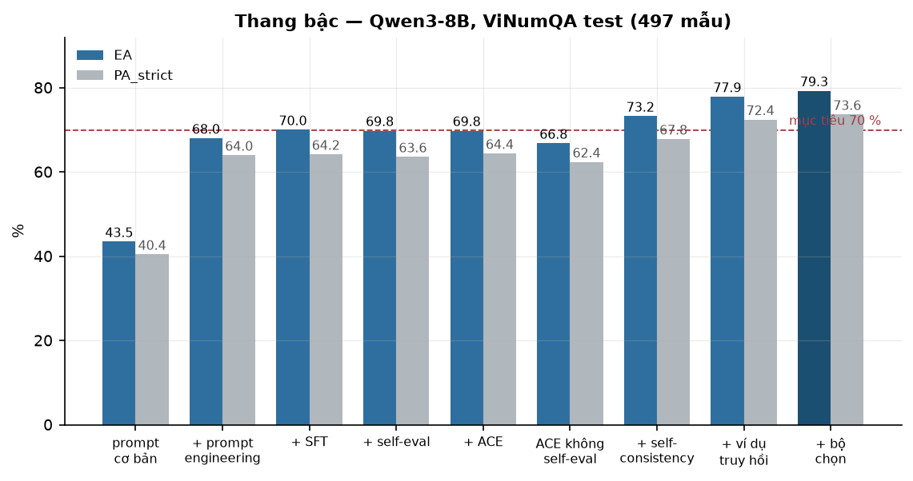
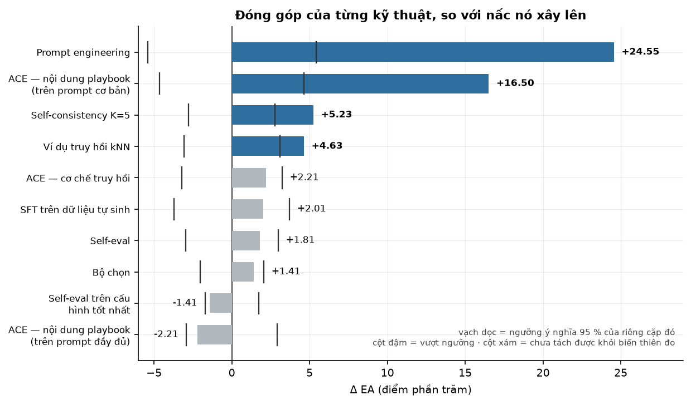
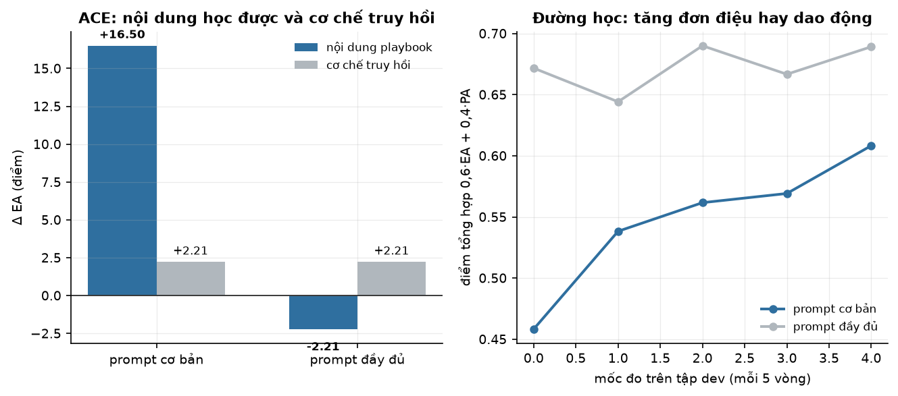
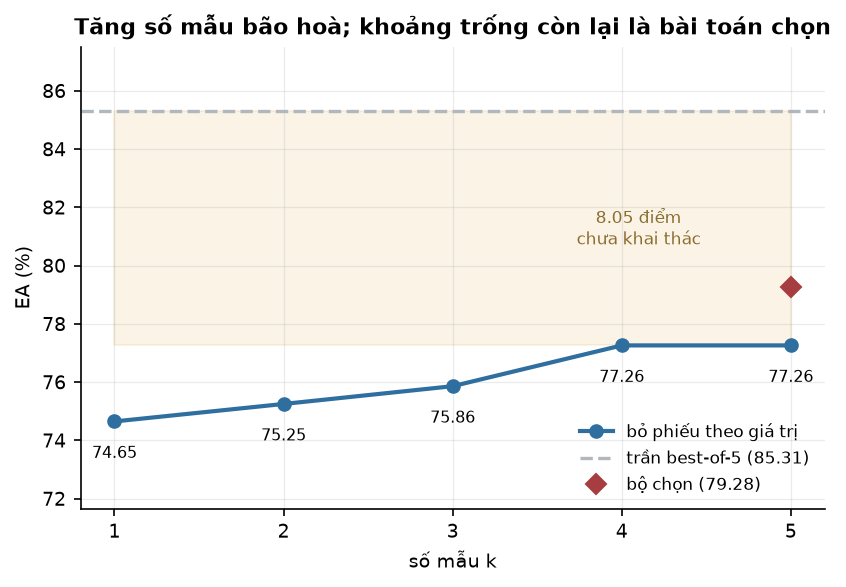
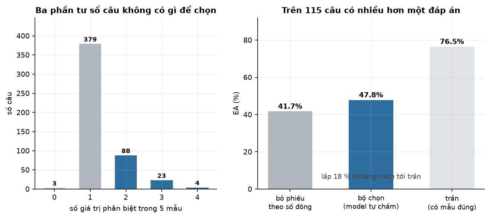
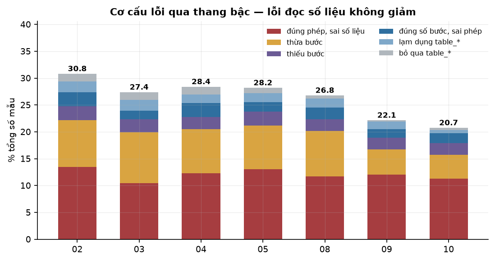

# Kết quả

Qwen3-8B · ViNumQA test 497 mẫu · A100-40GB · `temperature = 0.1` trừ nơi ghi rõ.

Thiết kế thực nghiệm: [`PHUONG_PHAP.md`](PHUONG_PHAP.md).

---

## 1. Thang bậc chính

| nấc | cấu hình | EA | PA_strict | PA_loose | không sinh được | không chạy được | phút |
| --- | --- | ---: | ---: | ---: | ---: | ---: | ---: |
| 01_basic | prompt cơ bản | 43,46 | 40,44 | 34,41 | 0,20 | 39,44 | 9,5 |
| 02_prompt_eng | prompt hoàn chỉnh | 68,01 | 63,98 | 60,36 | 0,20 | 1,21 | 9,7 |
| 03_sft | + SFT | 70,02 | 64,19 | 61,77 | 0,80 | 2,62 | 12,6 |
| 04_selfeval_base | + self-evaluation | 69,82 | 63,58 | 59,96 | 0,20 | 1,81 | 20,1 |
| 05_ace_base | + ACE | 69,82 | 64,39 | 59,15 | 0,20 | 2,01 | 21,9 |
| 06_comb_E_A | prompt + ACE | 66,80 | 62,37 | 58,55 | 0,00 | 1,81 | 10,9 |
| 08_tu_nhat_quan | + self-consistency K=5 | 73,24 | 67,81 | 63,38 | 0,00 | 0,00 | 32,6 |
| 09_vidu_dong | + ví dụ truy hồi kNN | 77,87 | 72,43 | 69,22 | 0,00 | 0,00 | 29,1 |
| **10_bo_chon** | **+ bộ chọn bằng mô hình** | **79,28** | **73,64** | **70,42** | 0,00 | 0,00 | 3,0 |

Cột *không sinh được* là tỷ lệ câu mô hình không xuất ra chương trình; *không chạy được*
là tỷ lệ chương trình bị executor từ chối. Prompt engineering đưa nhóm thứ hai từ 39,44 %
xuống 1,21 %; self-consistency đưa cả hai về 0.



### Nhánh đối chứng và ô mục tiêu

| nấc | mô tả | EA | PA_strict |
| --- | --- | ---: | ---: |
| 04_selfeval_base_moi | self-eval trên cấu hình tốt nhất | 76,46 | 71,63 |
| 05_ace_random_base | bullet ngẫu nhiên, prompt hoàn chỉnh | 67,61 | 62,78 |
| 05c_ace_basic_base | ACE trên prompt cơ bản | 62,17 | 57,34 |
| 05c_ace_basic_random_base | bullet ngẫu nhiên, prompt cơ bản | 59,96 | 55,73 |

---

## 2. Đóng góp của từng cơ chế

McNemar ghép cặp trên cùng 497 mẫu. *Hỏng* và *sửa* là số câu chỉ một bên làm đúng;
*ngưỡng* là mức 95 % tương ứng với lượng xáo trộn đó.

| cơ chế | so với | Δ EA | hỏng | sửa | ngưỡng | |
| --- | --- | ---: | ---: | ---: | ---: | :-: |
| Prompt engineering | 01_basic | **+24,55** | 33 | 155 | 5,41 | ✅ |
| ACE trên prompt cơ bản | 01_basic | **+18,71** | 26 | 119 | 4,75 | ✅ |
| Self-consistency K=5 | 02_prompt_eng | **+5,23** | 12 | 38 | 2,79 | ✅ |
| Ví dụ truy hồi kNN | 08_tu_nhat_quan | **+4,63** | 19 | 42 | 3,08 | ✅ |
| Supervised fine-tuning | 02_prompt_eng | +2,01 | 39 | 49 | 3,70 | — |
| Self-evaluation | 02_prompt_eng | +1,81 | 24 | 33 | 2,98 | — |
| Bộ chọn bằng mô hình | 09_vidu_dong | +1,41 | 10 | 17 | 2,05 | — |
| ACE trên self-evaluation | 04_selfeval_base | ±0,00 | 32 | 32 | 3,15 | — |
| ACE không self-evaluation | 02_prompt_eng | −1,21 | 36 | 30 | 3,20 | — |
| Self-eval trên cấu hình tốt nhất | 09_vidu_dong | −1,41 | 13 | 6 | 1,72 | — |
| **Tổng: nấc 10 so nấc 2** | 02_prompt_eng | **+11,27** | 18 | 74 | 3,78 | ✅ |

---



---

## 3. Phân rã ACE

Nhóm đối chứng dùng bullet lấy **ngẫu nhiên từ chính playbook đã học**, nên tách được
phần đóng góp của nội dung khỏi phần của cơ chế truy hồi.

| thành phần | phép so | trên prompt cơ bản | trên prompt hoàn chỉnh |
| --- | --- | ---: | ---: |
| nội dung playbook | không playbook → bullet ngẫu nhiên | **+16,50** ✅ | −0,40 |
| cơ chế truy hồi | bullet ngẫu nhiên → bullet truy hồi | +2,21 | +2,21 |
| tổng | | **+18,71** ✅ | +1,81 |



Đường học trên tập dev (240 mẫu, điểm tổng hợp `0,6·EA + 0,4·PA`, đo mỗi 5 vòng):

| | playbook rỗng | vòng 5 | vòng 10 | vòng 15 | vòng 19 |
| --- | ---: | ---: | ---: | ---: | ---: |
| prompt cơ bản (16 bullet) | 0,4583 | 0,5383 | 0,5617 | 0,5692 | **0,6083** |
| prompt hoàn chỉnh (12 bullet) | 0,6717 | 0,6442 | 0,6900 | 0,6667 | 0,6892 |

Trên prompt cơ bản, điểm tăng đơn điệu qua mọi mốc. Trên prompt hoàn chỉnh nó dao động
quanh mốc xuất phát.

Ví dụ quy tắc ACE học được trên prompt cơ bản:

```text
[db-00001] Khi hỏi TỶ LỆ thay đổi giữa hai kỳ, dùng
           subtract(gia_tri_moi, gia_tri_cu), divide(#0, gia_tri_cu)
[db-00003] Khi hỏi giá trị lớn nhất hoặc nhỏ nhất của một chỉ tiêu trong bảng,
           dùng table_max(ten_chi_tieu, none) hoặc table_min(ten_chi_tieu, none)
```

Đây đúng là nội dung mà prompt hoàn chỉnh đã chứa dưới dạng hướng dẫn viết tay.

---

## 4. Ma trận tổ hợp

Self-evaluation × ACE, giữ nguyên cấu hình sinh của thang bậc.

| ô | self-eval | ACE | EA | PA_strict |
| --- | :-: | :-: | ---: | ---: |
| E | · | · | 68,01 | 63,98 |
| E+A | · | ✓ | 66,80 | 62,37 |
| E+S | ✓ | · | 69,82 | 63,58 |
| E+S+A | ✓ | ✓ | 69,82 | 64,39 |

Tác động chính (trung bình 2 cặp, khoảng tin cậy bootstrap):

| yếu tố | Δ EA | KTC 95 % | |
| --- | ---: | --- | :-: |
| Self-evaluation | +2,41 | [+0,30; +4,63] | ✅ |
| ACE | −0,60 | [−3,02; +1,71] | — |

Tương tác self-evaluation × ACE: +1,21 điểm EA, KTC [−3,02; +5,23]. Không đủ bằng chứng
về tương tác ở cỡ mẫu này.

---

## 5. Self-consistency

Đường cong theo K, tính lại trên CPU từ 5 mẫu đã lưu của nấc 9:

| K | 1 | 2 | 3 | 4 | 5 | trần best-of-5 |
| --- | ---: | ---: | ---: | ---: | ---: | ---: |
| EA | 74,65 | 75,25 | 75,86 | **77,26** | 77,26 | 85,31 |
| PA_strict | 69,42 | 70,02 | 70,82 | **72,03** | 71,83 | 80,08 |

Đường cong phẳng từ K=4. Khoảng cách 7,44 điểm giữa kết quả đạt được và trần best-of-5
là phần mà một bộ chọn tốt hơn có thể lấy.



Phân tách riêng hai thành phần:

| thành phần | Δ EA | |
| --- | ---: | :-: |
| bỏ phiếu K=1 → K=5 (ví dụ cố định) | +3,62 | ✅ |
| bỏ phiếu K=1 → K=5 (ví dụ truy hồi) | +2,62 | ✅ |
| ví dụ truy hồi tại K=1 | +5,03 | ✅ |
| ví dụ truy hồi tại K=5 | +4,02 | ✅ |

Hai cơ chế chồng lấn một phần: ví dụ truy hồi cho +5,03 khi đứng một mình nhưng +4,02
khi đã có bỏ phiếu, và ngược lại. Chúng sửa một phần cùng nhóm câu.

---

## 6. Bộ chọn bằng mô hình

Phân bố số giá trị phân biệt trong 5 mẫu của nấc 9:

| số giá trị | 0 | 1 | 2 | 3 | 4 |
| --- | ---: | ---: | ---: | ---: | ---: |
| số câu | 3 | 379 | 88 | 23 | 4 |

382 câu chỉ ra một giá trị duy nhất — bỏ phiếu và bộ chọn cho kết quả như nhau. Phép đo
thực chất diễn ra trên **115 câu còn lại**:

| | số câu đúng | tỷ lệ |
| --- | ---: | ---: |
| bỏ phiếu theo giá trị | 48/115 | 41,7 % |
| **bộ chọn bằng mô hình** | **55/115** | **47,8 %** |
| trần (có mẫu đúng trong 5) | 88/115 | 76,5 % |

Bộ chọn lấp được 18 % khoảng cách tới trần. Mô hình đọc được lựa chọn ở 110/115 câu (5
câu còn lại giữ nguyên đáp án bỏ phiếu) và đổi đáp án ở 43 câu.

Toàn bộ 40 câu mà bỏ phiếu chọn sai trong khi có đáp án đúng đều thuộc trường hợp đáp án
đúng là **thiểu số**: 23 câu chỉ 1/5 mẫu đúng, 17 câu 2/5 mẫu đúng. Phép đếm theo số đông
về nguyên tắc không thắng được ở những câu này.



### Các luật bỏ phiếu thay thế

Thử trên cùng 5 mẫu đã lưu, không tốn thêm suy luận:

| luật | EA | PA_strict |
| --- | ---: | ---: |
| **bỏ phiếu theo giá trị thực thi** (đang dùng) | **77,26** | 72,03 |
| bỏ phiếu theo cấu trúc chương trình | 76,86 | 71,63 |
| giá trị, hoà thì theo chương trình phổ biến | 77,26 | 71,83 |
| giá trị, hoà thì chọn chương trình ngắn nhất | 77,26 | **72,84** |

Không luật đếm nào vượt được luật hiện tại về EA.

---

## 7. Phân bố lỗi

Nhóm lỗi *đúng phép toán, sai số liệu* — mô hình hiểu đúng bài nhưng lấy nhầm ô trong
bảng — qua các nấc:

| nấc | 02 | 03 | 04 | 05 | 08 | 09 | 10 |
| --- | ---: | ---: | ---: | ---: | ---: | ---: | ---: |
| số câu | 67 | 52 | 61 | 65 | 58 | 60 | 56 |
| tổng số câu sai | 153 | 136 | 141 | 140 | 133 | 110 | 103 |
| tỷ trọng | 44 % | 38 % | 43 % | 46 % | 44 % | 55 % | 54 % |



Số tuyệt đối gần như không đổi trong khi tổng số câu sai giảm từ 153 xuống 103. Các kỹ
thuật trong nghiên cứu này thu hẹp những nhóm lỗi khác nhưng không chạm tới nhóm này.

Ví dụ điển hình:

```text
câu hỏi : Tốc độ tăng trưởng lợi nhuận sau thuế dự kiến cho năm 2020 so với 2019?
mô hình : subtract(30854, 19296), divide(#0, 19296)
nhãn vàng: subtract(19296, 18511), divide(#0, 18511)
```

Dãy phép toán đúng hoàn toàn; hai toán hạng lấy sai cột trong bảng.

---

## 8. Chi phí

| nấc | phút GPU | Δ EA so nấc trước | điểm EA mỗi phút |
| --- | ---: | ---: | ---: |
| 02_prompt_eng | 9,7 | +24,55 | 2,53 |
| 08_tu_nhat_quan | 32,6 | +5,23 | 0,16 |
| 09_vidu_dong | 29,1 | +4,63 | 0,16 |
| 10_bo_chon | 3,0 | +1,41 | 0,47 |

Prompt engineering rẻ hơn mọi cơ chế khác một bậc độ lớn. Bộ chọn rẻ vì nó không sinh
lại lời giải nào — chỉ sinh 115 lượt chọn trên các mẫu đã có.

Tổng thời gian GPU cho toàn bộ nghiên cứu, gồm cả các nhánh đối chứng và SFT, khoảng 15
giờ.

---

## 9. File kết quả

Mỗi nấc ghi ra hai file trên Drive:

| file | nội dung |
| --- | --- |
| `<nấc>.jsonl` | từng mẫu: câu hỏi, chương trình, giá trị, EA/PA, phân loại lỗi, và với nấc K mẫu là cả 5 ứng viên |
| `<nấc>_meta.json` | tổng hợp chỉ số, cấu hình sinh, phiên bản thư viện, commit, GPU |

Notebook `07` tổng hợp mọi nấc đã có thành `bang_ket_qua_*.csv`, `kiem_dinh_*.csv` và
`bao_cao_*.png`.

Việc lưu đủ 5 ứng viên cho phép dựng lại đường cong theo K, thử các luật bỏ phiếu thay
thế, và chạy nấc 10 mà không cần sinh lại — toàn bộ phần 5 và 6 của tài liệu này tính
trên CPU từ một lần chạy GPU duy nhất.
